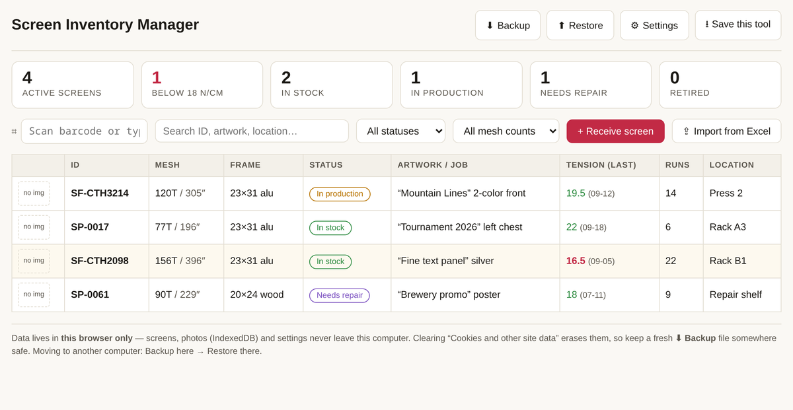
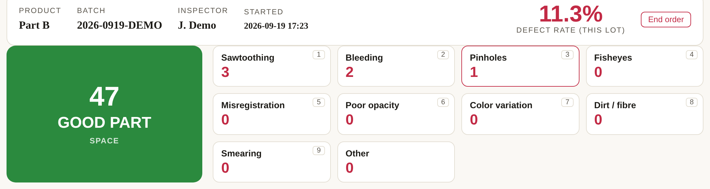
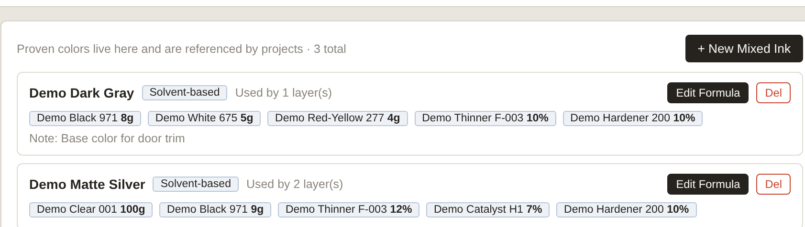
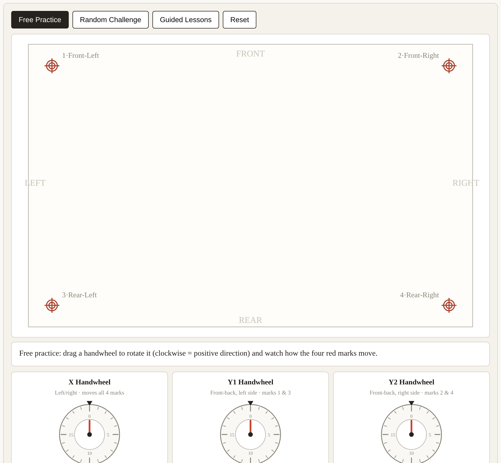
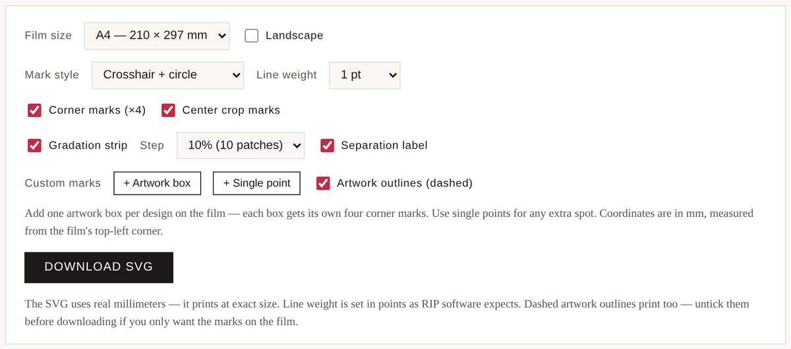

# Screen Printing Tools

Free, offline, single-file HTML tools for screen printing shops — built by a working screen printing engineer.

Each tool is **one .html file**: no server, no account, no installation. Open it in any browser and it just works; everything you enter stays on your own computer.

 

**▶ [Use the tools online](https://wittysune.github.io/screenprinting-tools/)** — running right now on GitHub Pages

**📖 [Full guides & more tools](https://screenprintfoundry.com/tools/)** — at ScreenPrint Foundry

 

---

## The tools

### 1 · Screen Inventory Manager

For shops that *buy* their screens: know where every screen is, what job it carries, and whether its tension is still above your floor.

- **Excel import with column mapping** — paste your sheet as-is, map your columns once, preview, import; duplicate IDs skipped, your own status names become custom statuses
- **Free-format screen IDs** — your numbering scheme, not the tool's; the ID becomes the barcode and the search key
- **Tension logging at every changeover** — 5-point (center + four corners) with live average, or 1-pt mode; per-screen decay curve with a red line at your threshold
- **Printable frame labels** — pick fields, exact mm size, Code 128 barcode auto-sized to fit; prints to any label printer
- **Scan-gun lookup** — a cheap USB/2.4G barcode scanner is just a keyboard: scan a frame from any screen and its record opens
- **Custom statuses** — rename / add / delete, with delete-protection for statuses in use; JSON backup & restore

[▶ Run it](https://wittysune.github.io/screenprinting-tools/tools/screen-inventory-manager.html) · [Full walkthrough](https://screenprintfoundry.com/process/screen-inventory-manager-guide/)

---

### 2 · Exposure Time Calculator

Read your step-wedge or factor-filter exposure test, get the corrected time — with the math shown.

- **Step-counting wedges** — Stouffer T2115 / T3110 / T4105 / T4110, SAATI 21-Step, Ryonet 21-Step, plus any custom wedge (your own step count and density increment)
- **Factor / neutral-density filters** — KIWO/Ulano ExpoCheck (×1.0–0.1), Chromaline Dual (interpolated readouts), SAATI Exposure Calculator (100 / 70 / 50 / 33 / 25%)
- **Off-the-scale cases handled** — nothing solid → double and retest; all solid → halve and retest; ≥4 steps off → a warning that extrapolation leans hard on reciprocity
- **Session log** — every round remembered (time → reading → suggested next), converges to *locked in*, JSON backup / restore

[▶ Run it](https://wittysune.github.io/screenprinting-tools/tools/exposure-time-calculator.html) · [Full walkthrough](https://screenprintfoundry.com/process/exposure-calculator-guide/) · [Step-wedge background guide](https://screenprintfoundry.com/process/find-your-exposure-time/)

### 3 · Print QC Logger

A browser-based inspection station for the end of your production line.

- One-keystroke good / defect counting, live defect rate
- Defect Pareto and per-inspector statistics, editable defect types
- Audit log, CSV export, multiple inspectors with sign-in

[▶ Run it](https://wittysune.github.io/screenprinting-tools/tools/print-qc-logger.html) · [About this tool](https://screenprintfoundry.com/tools/qc-logger/)

### 4 · Ink Recipe Manager

A local database for your ink formulas.

- Raw-material library, mixed-ink recipes with cost
- Per-project print layers with screen photos
- Weighing calculator — enter the weight you need, get per-component amounts
- Printable shop-floor mixing sheet

[▶ Run it](https://wittysune.github.io/screenprinting-tools/tools/ink-recipe-manager.html) · [About this tool](https://screenprintfoundry.com/tools/ink-recipe-manager/)

### 5 · 3-Axis Registration Adjustment Simulator

A training simulator for three-axis presses (X / Y1 / Y2).

- Read misregistration patterns and split them into translation, the common front-back component, and rotation
- Guided lessons, random challenges, step-by-step solutions
- Virtual handwheels — make your mistakes here, not on the machine

[▶ Run it](https://wittysune.github.io/screenprinting-tools/tools/registration-simulator.html) · [Full guide with lesson walkthroughs](https://screenprintfoundry.com/tools/registration-simulator/)

### 6 · Registration Mark Generator

Build a custom film-positive template, download as SVG.

- Corner registration marks, center crop marks, gradation strip, separation label, custom artwork boxes
- Matched to your film size — real millimetres, prints at exact size
- SVG imports into Illustrator / CorelDRAW / Inkscape

[▶ Run it](https://wittysune.github.io/screenprinting-tools/tools/registration-mark-generator.html) · [About this tool](https://screenprintfoundry.com/tools/registration-mark-generator/)

---

## How these work

| | |
|---|---|
| **Single file** | Each tool is one self-contained .html — copy it to a USB stick, a shop-floor PC, a Mac; it runs anywhere a browser runs |
| **Offline** | Zero network requests |
| **Private** | Data is stored in your browser's local storage on your machine; nothing is transmitted anywhere |
| **Backup** | Every tool with stored data has JSON export / import — use it before clearing browser data |

## More from this project

- [How to Find Your Exposure Time](https://screenprintfoundry.com/process/find-your-exposure-time/) — the step-wedge method explained
- [Exposure Calculator Walkthrough](https://screenprintfoundry.com/process/exposure-calculator-guide/) — complete tour of tool #1
- [ScreenPrint Foundry](https://screenprintfoundry.com) — production-grade screen printing guides and tools

## License

MIT — take them, use them, share them. A link back is appreciated but not required.
