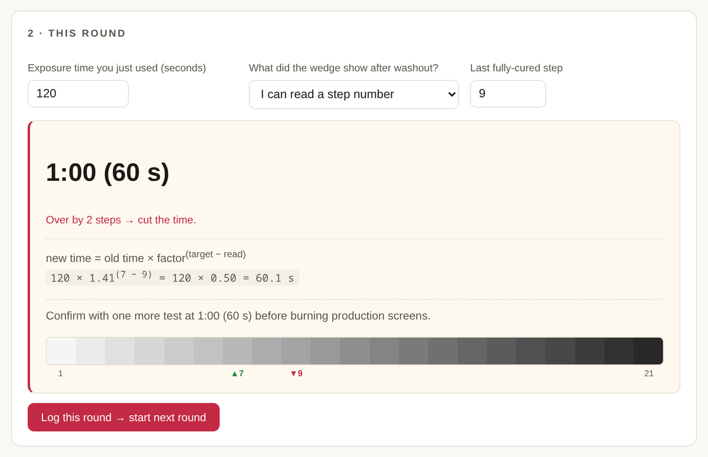

# Screen Printing Tools

Free, offline, single-file HTML tools for screen printing shops — built by a working screen printing engineer. Each tool is **one .html file**: no server, no account, no installation. Open it in any browser and it just works; everything you enter stays on your own computer.

**▶ Use the tools online (GitHub Pages): https://wittysune.github.io/screenprinting-tools/**
**📖 Full guides and more tools: https://screenprintfoundry.com/tools/**

## The tools

### 1. Exposure Time Calculator
Read your step-wedge or factor-filter exposure test, get the corrected time with the math shown.

- Step-counting wedges: Stouffer T2115 / T3110 / T4105 / T4110, SAATI 21-Step, Ryonet 21-Step, plus any custom wedge (your own step count and density increment)
- Factor / neutral-density filters: KIWO/Ulano ExpoCheck (×1.0–0.1), Chromaline Dual (interpolated readouts), SAATI Exposure Calculator (100/70/50/33/25%)
- Handles the two off-the-scale cases properly: nothing solid → double and retest; all solid → halve and retest; ≥4 steps off → warning that extrapolation leans hard on reciprocity
- Session log: every round remembered (time → reading → suggested next), converges to "locked in", JSON backup/restore
- [Run it](https://wittysune.github.io/screenprinting-tools/tools/exposure-time-calculator.html) · [Full walkthrough](https://screenprintfoundry.com/process/exposure-calculator-guide/) · [Step-wedge background guide](https://screenprintfoundry.com/process/find-your-exposure-time/)

### 2. Print QC Logger
A browser-based inspection station for the end of your production line.

- One-keystroke good / defect counting, live defect rate
- Defect Pareto and per-inspector statistics, editable defect types
- Audit log, CSV export, multiple inspectors with sign-in
- [Run it](https://wittysune.github.io/screenprinting-tools/tools/print-qc-logger.html) · [About this tool](https://screenprintfoundry.com/tools/qc-logger/)

### 3. Ink Recipe Manager
A local database for your ink formulas.

- Raw-material library, mixed-ink recipes with cost
- Per-project print layers with screen photos
- Weighing calculator (enter needed weight, get per-component amounts)
- Printable shop-floor mixing sheet
- [Run it](https://wittysune.github.io/screenprinting-tools/tools/ink-recipe-manager.html) · [About this tool](https://screenprintfoundry.com/tools/ink-recipe-manager/)

### 4. 3-Axis Registration Adjustment Simulator
A training simulator for three-axis presses (X / Y1 / Y2).

- Read misregistration patterns and split them into translation, the common front-back component, and rotation
- Guided lessons, random challenges, step-by-step solutions, virtual handwheels
- [Run it](https://wittysune.github.io/screenprinting-tools/tools/registration-simulator.html) · [Full guide with lesson walkthroughs](https://screenprintfoundry.com/tools/registration-simulator/)

### 5. Registration Mark Generator
Build a custom film-positive template, download as SVG.

- Corner registration marks, center crop marks, gradation strip, separation label, custom artwork boxes
- Matched to your film size; SVG imports into Illustrator / CorelDRAW / Inkscape
- [Run it](https://wittysune.github.io/screenprinting-tools/tools/registration-mark-generator.html) · [About this tool](https://screenprintfoundry.com/tools/registration-mark-generator/)

## How these work

- **Single file**: each tool is one self-contained .html — copy it to a USB stick, a shop-floor PC, a Mac, it runs anywhere a browser runs
- **Offline**: zero network requests
- **Private**: data is stored in your browser's local storage on your machine; nothing is transmitted anywhere
- **Backup**: every tool with stored data has JSON export/import — use it before clearing browser data

## More from this project

The tools live alongside in-depth production guides at [screenprintfoundry.com](https://screenprintfoundry.com):

- [How to Find Your Exposure Time](https://screenprintfoundry.com/process/find-your-exposure-time/) — the step-wedge method explained
- [Exposure Calculator Walkthrough](https://screenprintfoundry.com/process/exposure-calculator-guide/) — complete tour of tool #1
- [Tools index](https://screenprintfoundry.com/tools/) — mesh converters, mesh selector and more

## License

MIT — take them, use them, share them. If you build on them, a link back is appreciated but not required.
